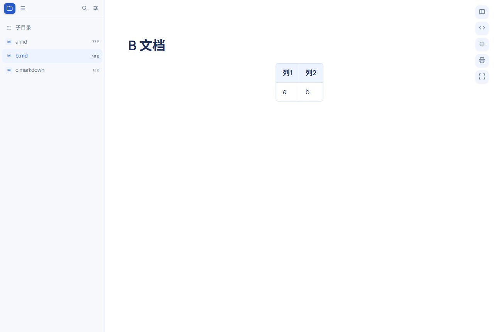
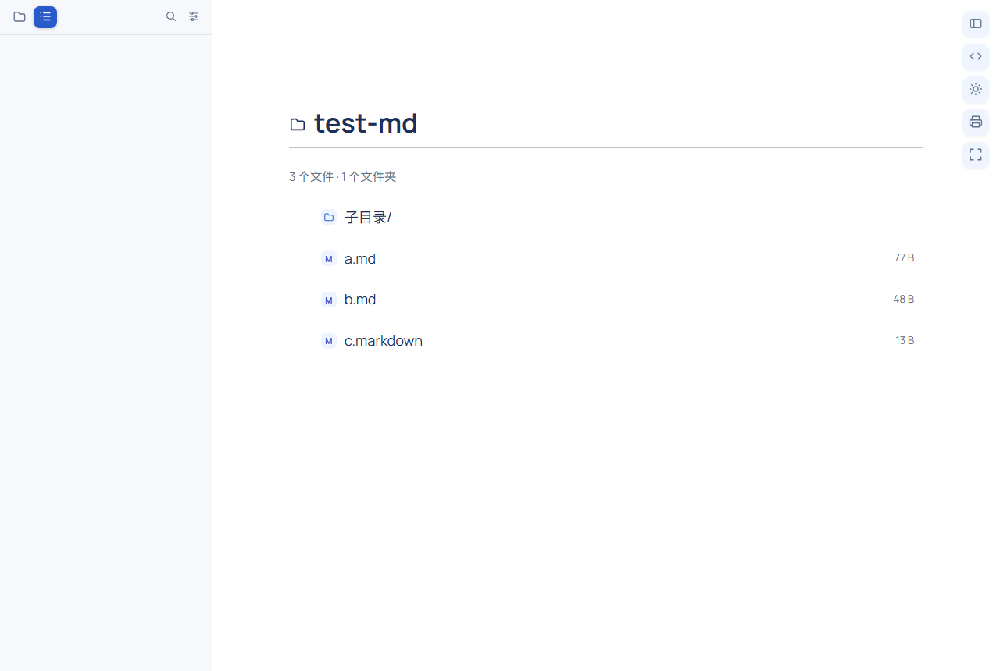
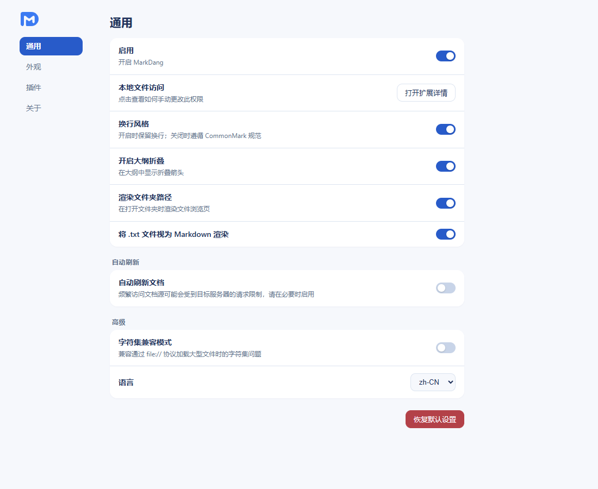

# MarkDang

MarkDang (码刻档) is a browser extension that renders Markdown files into a readable, consistently styled view inside Chrome and Edge.

[](LICENSE)
[](https://developer.chrome.com/docs/extensions/develop/concepts/manifest-v3)
[](#tech-stack)
[](#testing)
[](README.zh-CN.md)

中文说明：[README.zh-CN.md](README.zh-CN.md)

| Reading view (light) | Reading view (dark), outline collapsed |
| --- | --- |
|  |  |

| Sidebar folder tab | Folder view | Options page |
| --- | --- | --- |
|  |  |  |

## Features

- Renders `.md`, `.markdown`, `.mdx`, `.mkd` — and optionally `.txt` — from `http(s)` and `file://` URLs
- Light, dark, and system-following page theme, with an independent code-block theme per mode
- Sidebar with two tabs: document outline (collapsible headings, expand/collapse all, live filter) and folder directory (search, sort by name/size/date, folders first, hidden files)
- A local folder URL renders as a file browser page
- Auto refresh re-renders the document while you edit it (interval 0.5–600 s)
- 19 markdown-it plugins, each individually switchable with its own options: KaTeX math, Mermaid diagrams (lazy-loaded), PlantUML (off by default), GitHub-style alerts, task lists, footnotes, Multi-Markdown tables, TOC, and others
- Zen mode, print stylesheet, fullscreen, back-to-top, code copy buttons, image zoom
- Configurable content width (px/%), font size, font family, and custom CSS

## Install

### From a release

1. Download `markdang-v1.0.0.zip` from [Releases](../../releases) and unzip it
2. Open `chrome://extensions` (Edge: `edge://extensions`)
3. Enable Developer mode
4. Click Load unpacked and select the `extension` folder
5. In the extension details, enable Allow access to file URLs — required for local files and folders

The folder is referenced in place; do not delete or move it after loading.

### From source

```bash
git clone https://github.com/YOUR_USER/markdang.git
cd markdang
npm install --legacy-peer-deps
npm run build        # outputs to extension/
```

Then load `extension/` as described above.

## Usage

Open any supported file and it renders immediately. A local folder URL (for example `file:///D:/docs/`) renders as a file browser.

Sidebar tabs:

| Tab | Function |
| --- | --- |
| Folder | All Markdown files in the current directory; click to switch. Search, sorting, folders-first, hidden files |
| Outline | Document headings with collapse arrows; expand/collapse all in the gear menu; live filter |

Action buttons (top right):

| Button | Action |
| --- | --- |
| Sidebar icon | Collapse or expand the sidebar |
| `</>` | Toggle raw source view (sidebar hides, buttons stay) |
| Sun | Toggle light/dark (Auto is available in the options page) |
| Printer | Print with the reader-optimized stylesheet |
| Corners | Fullscreen |
| Arrow up | Back to top (appears after scrolling) |

Keyboard shortcuts (editable at `chrome://extensions/shortcuts`):

| Shortcut | Action |
| --- | --- |
| `Alt+Shift+B` | Toggle sidebar |
| `Alt+Shift+C` | Toggle centered layout |
| `Alt+Shift+R` | Toggle auto refresh |
| `Alt+Shift+T` | Toggle theme |
| `Esc` | Exit zen mode / close menus |

## Settings

The full reference with defaults lives in [docs/settings.md](docs/settings.md). Every option has an observable example in [`demo/full-feature-test.md`](demo/full-feature-test.md) — open it and toggle the setting to see the effect.

## Testing

Three suites drive a real browser (Edge via playwright-core) with the unpacked extension loaded; all must pass before a release:

```bash
node scripts/e2e.mjs           # 44 — feature and data-flow assertions (incl. Mermaid lazy-load)
node scripts/test-ux.mjs       # 21 — interaction paths (clicks, menus, themes)
node scripts/test-options.mjs  # 22 — per-option observable effects
```

Development setup is described in [docs/development.md](docs/development.md).

## Tech stack

| Layer | Choice |
| --- | --- |
| Build | Vite 5, three-pass build (ES pages + IIFE content script / service worker) |
| Language | TypeScript, strict mode |
| Options UI | Preact 10 |
| Markdown | markdown-it 14 with 15 plugins plus custom TOC/alert/front-matter/bare-math extensions |
| Diagrams | Mermaid 11 (lazy-loaded from the extension package), PlantUML server rendering (opt-in) |
| Highlighting | highlight.js 11 with dual light/dark palettes |
| Math | KaTeX, styles and fonts inlined into the content bundle |
| Typography | Manrope (variable) and Source Code Pro, bundled locally via `@font-face` |
| Testing | playwright-core against a real browser, three assertion suites |

Implementation notes are collected in [docs/architecture.md](docs/architecture.md): the content script and MV3 service worker are bundled as single-file IIFE (no `import` statements), noncharacter code points are escaped after the build (Chromium rejects them as "not UTF-8"), and the Mermaid bundle ships inside the extension and is imported only when a diagram is present.

## Project layout

```
├── src/
│   ├── shared/       # settings schema + IPC
│   ├── background/   # service worker: hidden-tab directory/document probe, shortcuts
│   ├── content/      # reader: markdown pipeline, sidebar, folder view, styles
│   ├── options/      # options page (Preact)
│   └── popup/        # popup (reuses the options component)
├── demo/             # full-feature-test.md — live example for every option
├── docs/             # settings reference, development guide, architecture, screenshots
├── scripts/          # build, three test suites, screenshots, zip
└── public/           # manifest, icons, brand assets, fonts
```

## License

The code is licensed under the [PolyForm Noncommercial License 1.0.0](LICENSE): free to use, study, modify, fork, and redistribute for personal and noncommercial purposes. Commercial use requires a separate license. This is source-available software, not OSI-defined open source.

The MarkDang / 码刻档 name, logo, icons, and visual identity are not covered by the code license and remain proprietary; forks must rebrand. See [TRADEMARKS.md](TRADEMARKS.md) and [NOTICE](NOTICE).
