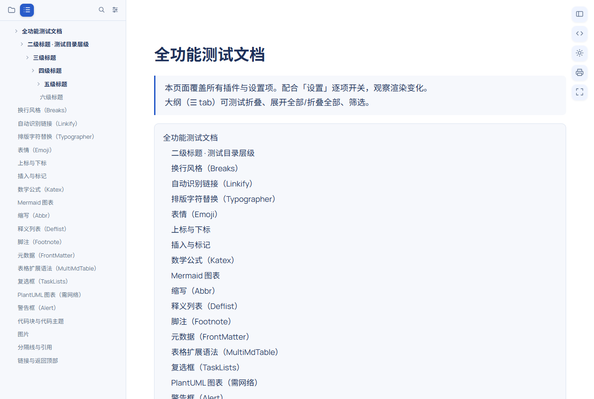
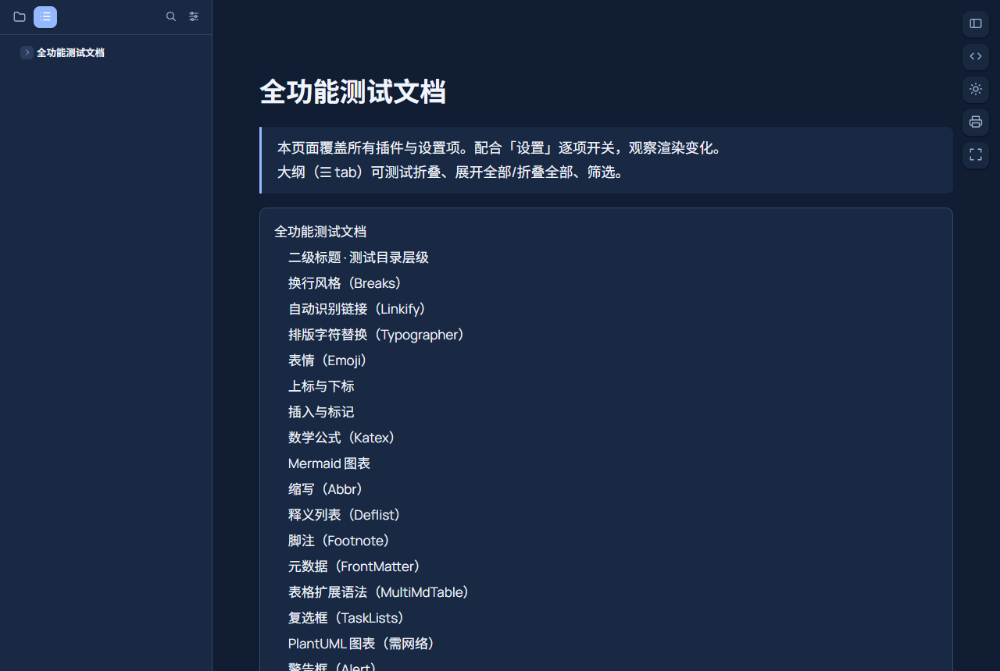

# MarkDang 码刻档

MarkDang 在 Chrome 和 Edge 中将 Markdown 文档转换为舒适的阅读视图，提供大纲和可选的文件目录浏览。无账号、无订阅、无遥测。

[English](README.md) · [设置参考](docs/settings.zh-CN.md) · [开发指南](docs/development.zh-CN.md) · [隐私声明](PRIVACY.zh-CN.md)

[](https://github.com/emorywang/markdang/actions/workflows/build.yml)
[](LICENSE)

| 浅色阅读视图 | 深色阅读视图 |
| --- | --- |
|  |  |

截图展示初始 1.0.0 的视觉设计，当前源码中的部分控件可能略有不同。

## 功能

- 阅读本地或网页提供的 `.md`、`.markdown`、`.mdx`、`.mkd`，也可选择将 `.txt` 作为 Markdown 阅读。
- 浅色、深色和跟随系统主题；独立代码块配色；字体、字号、内容宽度和自定义 CSS。
- 大纲折叠、搜索；当前目录的 Markdown 文件浏览、排序；本地文件夹阅读视图。
- 数学公式、Mermaid、表格、警告框、任务列表、脚注、目录等 Markdown 扩展，共 19 个插件开关，其中 PlantUML 是需单独开启的网络功能。
- 原始内容、禅模式、打印、全屏、代码复制、图片缩放和自动刷新。

MDX 按 Markdown 读取，不执行 JSX、导入语句或 JavaScript。网页文档还需要服务器返回纯文本或 Markdown MIME 类型；普通 HTML 网页、下载响应、浏览器受保护页面和没有受支持扩展名的网页 URL 不会自动转换。扩展名支持全小写或全大写，包括带查询参数的形式。

界面支持简体中文和英文。默认「自动」跟随浏览器的界面语言：中文环境显示简体中文，其他语言环境显示英文。可在「通用 → 界面语言」手动选择，已打开的设置页和阅读器会立即更新。完整选项和默认值见 [设置参考](docs/settings.zh-CN.md)。网页目录浏览需要服务器提供可读取的 HTML 目录索引。

## 安装

### 从源码构建

需要 Node.js **22.12 及以上**，推荐 24 LTS：

```bash
git clone https://github.com/emorywang/markdang.git
cd markdang
npm ci
npm run build
```

1. 打开 `chrome://extensions` 或 `edge://extensions`。
2. 开启「开发者模式」，选择「加载已解压的扩展程序」。
3. 选择生成的 `extension/` 目录，该目录中包含 `manifest.json`。
4. 如需读取本地文件或文件夹，在扩展详情中开启「允许访问文件网址」。弹窗设置页也会显示当前权限状态。

请保留所选目录。重新构建后，重载扩展并刷新文档标签页。

### 从发布包安装

[Releases](https://github.com/emorywang/markdang/releases) 提供发布包后，下载 `markdang-v<version>.zip`，解压到固定目录，再按上述步骤加载**该解压目录**。ZIP 根目录直接包含 `manifest.json`，内部没有额外的 `extension/` 文件夹。

当前仓库尚未提供浏览器商店安装链接。

## 使用

打开支持的文档 URL，例如 `file:///D:/docs/README.md` 或网站提供的原始 Markdown 文件。侧栏提供大纲和文件目录两个标签；工具按钮用于切换侧栏、原始内容、主题，以及打印、全屏和返回顶部。禅模式保留退出按钮，也可按 Esc 退出。

快捷键可在 `chrome://extensions/shortcuts` 或 Edge 对应页面修改：

| 快捷键 | 功能 |
| --- | --- |
| `Alt+Shift+B` | 收起或展开侧栏 |
| `Alt+Shift+C` | 切换内容居中 |
| `Alt+Shift+R` | 切换自动刷新 |
| `Alt+Shift+T` | 循环切换浅色、深色和跟随系统 |
| `Esc` | 退出禅模式，关闭菜单或图片缩放 |

自动刷新间隔为 0.5–600 秒。本地刷新会短暂打开非活动标签页；可调大间隔以减少探测频率。任务勾选仅改变显示内容，不写回原文件，刷新后会恢复。

## 隐私与安全

文档解析、数学、代码高亮、Mermaid 和字体均在本地运行；设置保存在当前浏览器配置中。文档 HTML 和生成的 SVG 会进行安全清理；Mermaid 使用严格模式，不开放脚本交互。

网页文档与远程图片仍会向其来源网站发起请求。**PlantUML 默认关闭，开启后会将图表源码发送至 www.plantuml.com。** 自定义 CSS 也可能加载远程资源。详见 [隐私声明](PRIVACY.zh-CN.md)。

manifest 仅请求 `storage` API 权限，但内容脚本的 URL 匹配范围也授予页面访问能力；没有单独的 `host_permissions` 字段不代表没有页面权限。

## 开发与验证

```bash
npm run check                         # 类型检查、单元测试、干净构建
npx playwright-core install chromium  # Linux 可能需要 --with-deps
npm run test:e2e                       # 功能、交互、选项和回归测试
npm run dev                           # 源码变更后重新构建
npm run zip                           # 重新构建并打包
```

测试数据位于仓库中，每套浏览器测试使用独立配置。开发与发布流程见 [开发指南](docs/development.zh-CN.md)、[架构说明](docs/architecture.zh-CN.md) 和 [发布清单](docs/publishing.zh-CN.md)。CI 运行相同检查与浏览器测试。

项目使用 TypeScript、Preact、Vite 7、markdown-it、DOMPurify、KaTeX、highlight.js、Mermaid 和 pako。采用五段式构建；执行代码随扩展分发，Mermaid 仅在需要时从扩展包内加载。

## 许可证与署名

本项目是 **Source Available for Noncommercial Use**，代码使用 [PolyForm Noncommercial License 1.0.0](LICENSE)。个人与非商业用途可依照许可证使用、修改及再发布，商业用途需单独授权。限制涵盖商业使用本身，不仅是销售二次开发版本；这不是 OSI 定义的开源许可证。

名称、Logo、图标和视觉识别是保留权利的品牌资产。对外发布的 Fork 或衍生产品须采用不同品牌并保留署名，详见 [TRADEMARKS.md](TRADEMARKS.md) 和 [NOTICE](NOTICE)。第三方组件与字体保留各自许可证，发布包附带完整文本。

## 支持开发

喜欢码刻档？请我喝杯咖啡，支持后续开发：[爱发电](https://afdian.com/a/emory) · [Ko-fi](https://ko-fi.com/emorywang)。
