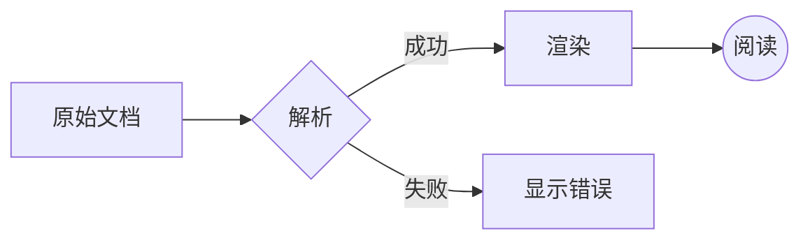
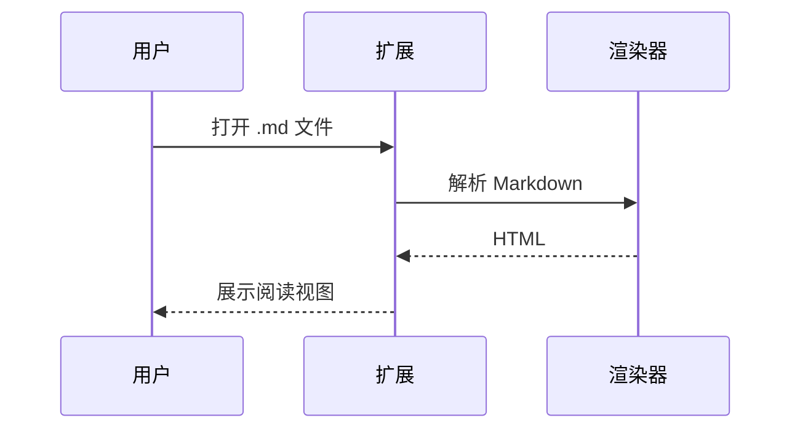
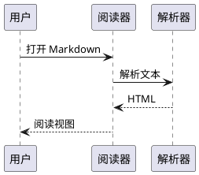

# 全功能测试文档

> 本页面演示 Markdown 插件及主要阅读选项。配合「设置」逐项开关，观察渲染变化。
> 大纲（☰ tab）可测试折叠、展开全部/折叠全部、筛选。

[[TOC]]

## 二级标题 · 测试目录层级

在设置 → 插件 → 目录（齿轮）里调整「标题层级」勾选 1–6，看目录变化；
「列表类型」切换无序/有序时会应用到目录的**所有层级**。

### 三级标题

#### 四级标题

##### 五级标题

###### 六级标题

## 换行风格（Breaks）

下面两行之间只有一个换行符：
开启「换行风格」时这两行
会显示为两行；关闭时遵循 CommonMark 规范合并成一行。

## 自动识别链接（Linkify）

- 普通文本链接：https://github.com/emorywang/markdang
- 邮箱地址 someone@example.com（开启「模糊邮箱」后可点击）
- IP 地址（模糊 IP 开启时可见）：192.168.1.100

注意：linkify-it 分词器要求邮箱与中文字符之间留有空格，紧跟中文时不会识别（上游行为）。

在设置 → 插件 → 自动识别链接（齿轮）中分别开关三个模糊选项对比效果。

## 排版字符替换（Typographer）

(c) (C) (R) (TM) (p) -- --- ... 不会变的 `code (c)` 部分。

## 表情（Emoji）

:smile: :+1: :sparkles: :heart: :bug: :rocket:

## 上标与下标

水的化学式 H~2~O；第 19^th^ 届会议。

## 插入与标记

++插入的文字++ 和 ==标记的文字==。

## 数学公式（Katex）

行内公式：质能方程 $E = mc^2$ 以及 $\sqrt{3x-1}+(1+x)^2$。

块级公式：

$$
\int_{-\infty}^{\infty} e^{-x^2} \, dx = \sqrt{\pi}
$$

裸公式（设置里开启「启用裸数学公式」后渲染）：

\begin{align}
\nabla \cdot \vec{E} &= \frac{\rho}{\varepsilon_0} \\
\nabla \times \vec{B} &= \mu_0 \vec{J}
\end{align}

围栏公式（开启「启用围栏数学公式」后，```math 代码块渲染为公式）：

```math
x = \frac{-b \pm \sqrt{b^2-4ac}}{2a}
```

HTML 中的块数学公式（开启「渲染在 HTML 中的块数学公式」后渲染）：

<div>
$$\int_0^1 x^2 \, dx = \frac{1}{3}$$
</div>

HTML 中的行内数学公式（开启「渲染在 HTML 中的行内数学公式」后渲染）：

<div>行内：$a^2 + b^2 = c^2$</div>

## Mermaid 图表





## 缩写（Abbr）

HTML 规范由 W3C 维护。

*[HTML]: Hyper Text Markup Language
*[W3C]: World Wide Web Consortium

## 释义列表（Deflist）

Markdown
: 一种轻量级标记语言。

阅读器
: 把纯文本变成舒服阅读体验的工具。

## 脚注（Footnote）

这里有一个脚注[^1]，还有一个长脚注[^long]。

[^1]: 这是脚注内容。
[^long]: 这是一个包含很多文字的脚注，用来测试渲染效果。

## 元数据（FrontMatter）

本页顶部的 `--- title: ... ---` 就是 Front Matter。
在设置 → 插件 → 元数据（齿轮）里开启「显示元数据」后，文档顶部会渲染为表格。

## 表格扩展语法（MultiMdTable）

普通表格：

| 功能 | 状态 | 备注 |
| --- | --- | --- |
| 目录 | ✅ | [[TOC]] 语法 |
| 大纲折叠 | ✅ | 侧边栏箭头 |

跨行合并单元格（开启「跨行合并单元格」后，`^^` 与上方单元格合并）：

| 阶段 | 产物 | 产量 |
| --- | --- | --- |
| 糖酵解 | 2 ATP ||
| ^^ | 2 NADH | 3–5 ATP |
| 丙酮酸氧化 | 2 NADH | 5 ATP |
| ^^ | 2 FADH2 | 3 ATP |

跨行在单元格内换行（开启「跨行在单元格内换行」后，行尾 `\` 使下一行并入本行）：

| 项目 | 说明 |
| --- | --- |
| 第一步 | 打开扩展详情 | \
| （续上格） | 开启文件访问 |
| 第二步 | 加载扩展 |

无表头模式（开启后生效，直接以分隔线开头）：

|---|---|---|
| 单元格 | 单元格 | 单元格 |
| 单元格 | 单元格 | 单元格 |

多级表体（开启后，空行分隔出多个表体 section）：

| A | B |
| --- | --- |
| 1 | 2 |

| 3 | 4 |

自动生成标题标签（开启后：表格下方的 `[标签]` 行渲染为带锚点链接的 caption——注意标题前的 # 号；关闭时为普通 caption）：

| A | B |
| --- | --- |
| 1 | 2 |
[Prototype table]

| A | B |
| --- | --- |
| 3 | 4 |
[我的示例表格]

## 复选框（TaskLists）

- [x] 已完成的任务
- [ ] 待办任务
- [ ] 另一个待办任务

设置 → 插件 → 复选框（齿轮）：
- **允许勾选**：复选框变为可点击（不再禁用）；
- **将任务项渲染在标签内**：文字被 `<label>` 包裹（点击文字即可切换勾选）；
- **将文字显示在复选框之前**：默认复选框在文字前；开启后文字移到复选框之前（需先开启上一项，开启本项会自动补开）。

## PlantUML 图表（需网络）

开启插件后，图表源码会发送到 PlantUML 官方服务器渲染为图片
（请勿在图表中包含敏感信息；文档引用的远程图片仍可能产生网络请求）：



## 警告框（Alert）

> [!NOTE]
> 这是 GitHub 风格的 NOTE 提示。

> [!TIP]
> 这是 TIP 提示。

> [!IMPORTANT]
> 这是 IMPORTANT 提示。

> [!WARNING]
> 这是 WARNING 警告。

> [!CAUTION]
> 这是 CAUTION 危险提示。

命名容器（设置里可逐个开关）：

::: info
这是 ::: info 信息容器。
:::

::: tip
这是 ::: tip 提示容器。
:::

::: success
这是 ::: success 成功容器。
:::

::: warning
这是 ::: warning 警告容器。
:::

::: danger
这是 ::: danger 危险容器。
:::

嵌套（开启「嵌套 Alert」后生效）：

::: warning
外层警告

> [!NOTE]
> 嵌套的内层 NOTE
:::

## 代码块与代码主题

```js
// 浅色/深色代码块主题：设置 → 外观 → 两个代码块主题开关
function fibonacci(n) {
  if (n <= 1) return n;
  return fibonacci(n - 1) + fibonacci(n - 2);
}
console.log(fibonacci(10)); // 55
```

```python
def greet(name: str) -> str:
    """测试 Python 语法高亮。"""
    return f"Hello, {name}!"

print(greet("MarkDang"))
```

下面这行超长代码用于测试「代码自动换行」开关：

```js
const veryLongLine = "这是一段非常非常长的代码用于测试代码自动换行功能，当你在外观设置里打开代码自动换行时这一行会折行显示而不是出现横向滚动条，关闭时则保持单行并出现横向滚动条。";
```

## 图片


## 分隔线与引用

---

> 普通引用块。
> 第二行引用。

## 链接与返回顶部

滚动到页面底部测试「回顶部」按钮：[跳到目录](#全功能测试文档)

这一段重复文字用来撑高页面。

段落段落段落段落段落段落段落段落段落段落段落段落段落段落。

段落段落段落段落段落段落段落段落段落段落段落段落段落段落。

段落段落段落段落段落段落段落段落段落段落段落段落段落段落。
