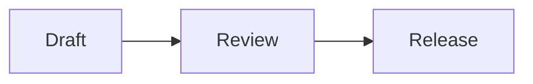

# MarkDang reading sample

This public example contains no private project information.

## Code

```js
const files = ['README.md', 'design.md', 'release.md']
const notes = files.filter(file => file.endsWith('.md'))

for (const file of notes) {
  console.log(file)
}
```

## Table and tasks

| File | Purpose |
| --- | --- |
| README.md | Project overview |
| design.md | Design notes |
| release.md | Release checklist |

Enable Task lists in the plugin settings to try the checkboxes. Changes affect the displayed page only.

- [x] Read the documentation
- [ ] Check light and dark themes
- [ ] Open a second Markdown file from the folder panel

## Math

A weighted average is $\bar{x}=\frac{\sum_i w_i x_i}{\sum_i w_i}$.

$$
\sum_{i=1}^{n} i = \frac{n(n+1)}{2}
$$

## Diagram



## Reading controls

Use the outline to return to a section. Try source view, zen mode, printing, and themes. Esc exits zen mode. The original file remains unchanged.

> [!NOTE]
> Local files require Chrome's “Allow access to file URLs” setting. PlantUML is off by default and is not used here.
